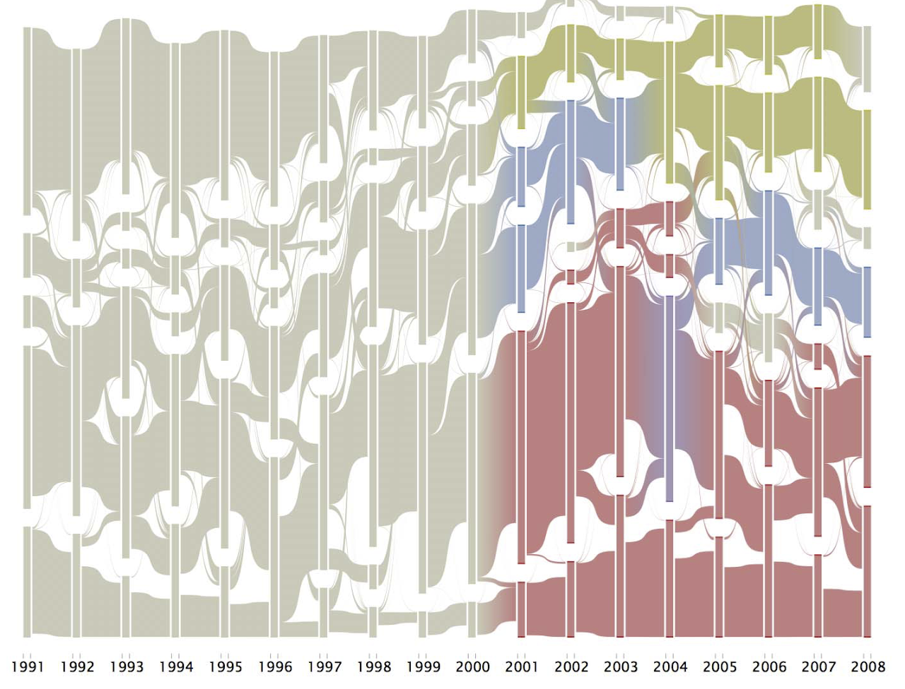
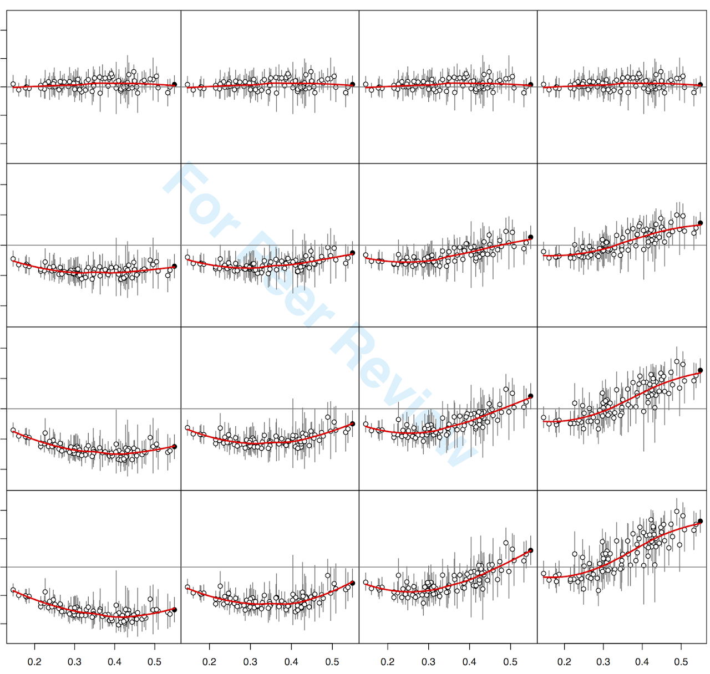
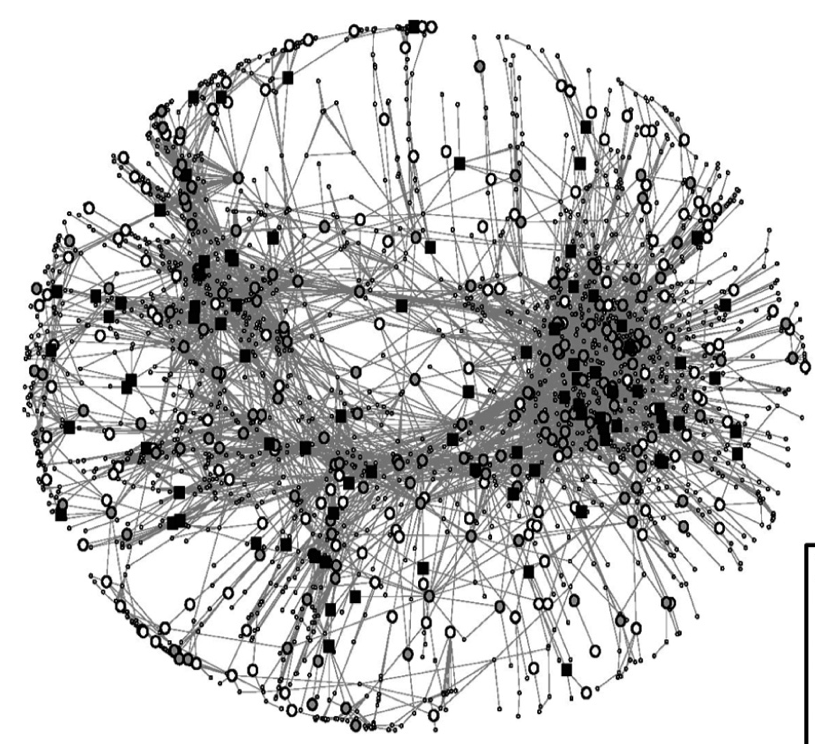

_____

### IDEAS: Interdisciplinary Dynamics in Emerging Areas of Science

With [Ryan Light](https://sociology.uoregon.edu/profile/light/), I am examining patterns of disciplinary integration in "problem" oriented areas of science. My primary sabbatical project is working on a book manuscript from this work.

(This work has previously been funded in part by the Robert Wood Johnson Foundation's [Health and Society Scholars Program](http://www.healthandsocietyscholars.org/) at Columbia University.)

_____

### Diffusion Processes: Social Network Influences on Health Behaviors & Outcomes

What do smoking, HIV/AIDS, hypertension and flu have in common? The possibility of being shaped by one's peers and shaping who we select as friends. I'm primarily interesed in the diffusion/influence part of these processes, but estimating those properly also requires accounting for the selection side of the equation. 

(This work has previously been funded in part by the [National Institutes of Health](https://www.lrp.nih.gov/eligibility-programs#ex-disparities-content), and the Colorado Department of Public Health & Environment.)

_____
### Network Methods: Evaluating & Improving Social Network Data Collection Methods

Development of network theory and analytic strategies have occasionally outpaced the availability of data. I'm interested in altering that, and evaluating the quality of such efforts.
