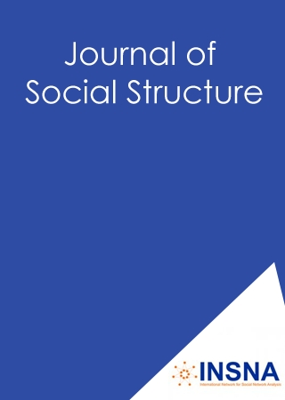

This is an incomplete sample of recent and/or key papers of mine. For a complete list, see my [CV](/cv/), or [Google Scholar page](https://scholar.google.com/citations?user=G-u6TvEAAAAJ). If you have difficulty locating a copy of any of these, please email me for a copy.

| <!-- -->    | <!-- --> |
| :-: | :------------ |
|{: width="75px" align="left"} | 2020. **jimi adams**, Ryan Light, & Nicholas Theis (1st 2 authors contributed equally). “[Mobilizing COVID-19 Science](https://jimiadams.github.io/Contexts_PubMed/).” *Contexts* 19(4): 36-41.   [code](https://github.com/jimiadams/Contexts_PubMed){: .btn .btn--primary .btn--small} [doi](https://doi.org/10.1177/1536504220977933){: .btn .btn--inverse .btn--small}|
|{: width="75px" align="left"} | 2020. **jimi adams**, +Tatiane Santos, & +Venice Ng Williams. “[Strategies for Collecting Social Network Data:Overview, Assessment and Ethics](https://www.oxfordhandbooks.com/view/10.1093/oxfordhb/9780190251765.001.0001/oxfordhb-9780190251765-e-10).” Chapter 7 in Ryan Light & James Moody (eds.) *Oxford Handbook of Social Networks* Oxford University Press.   [preprint](https://osf.io/preprints/socarxiv/zgawf/){: .btn .btn--success .btn--small} [book](https://global.oup.com/academic/product/the-oxford-handbook-of-social-networks-9780190251765){: .btn .btn--info .btn--small} [doi](https://doi.org/10.1093/oxfordhb/9780190251765.013.10){: .btn .btn--inverse .btn--small}|
|{: width="75px" align="left"} | 2020. Andrea G. Buchwald, **jimi adams**, David M. Bortz, & Elizabeth J. Carlton. “[Infectious disease transmission models to predict, evaluate and improve understanding of SARS-COV-2 trajectory and interventions](https://www.atsjournals.org/doi/full/10.1513/AnnalsATS.202005-501PS).” *Annals of the American Thoracic Society* 17(10): 1204-1206.   [doi](https://doi.org/10.1513/AnnalsATS.202005-501PS){: .btn .btn--inverse .btn--small}|
|{: width="75px" align="left"} | 2020. **jimi adams**, David R. Schaefer, & Andrea Vest Ettekal. “[Crafting Mosaics: Person‐Centered Religious Influence and Selection in Adolescent Friendships](https://onlinelibrary.wiley.com/doi/abs/10.1111/jssr.12638).” *Journal for the Scientific Study of Religion* 59(1): 39-61.   [data](https://www.icpsr.umich.edu/web/DSDR/studies/21600){: .btn .btn--danger .btn--small} [preprint](https://osf.io/preprints/socarxiv/dc5gh/){: .btn .btn--success .btn--small} [doi](https://doi.org/10.1111/jssr.12638){: .btn .btn--inverse .btn--small}|
|{: width="75px" align="left"} | 2019. **jimi adams** & Adam M. Lippert. “[Under the Radar: Simplifying the Representation of Latent Class Characteristics](https://journals.sagepub.com/doi/10.1177/2378023119873498).” *Socius* 5: 1-3.   [data](https://github.com/jimiadams/LCA-Viz/tree/master/data){: .btn .btn--danger .btn--small} [code](https://github.com/jimiadams/LCA-Viz){: .btn .btn--primary .btn--small} [preprint](https://jimiadams.github.io/LCA-Viz/){: .btn .btn--success .btn--small} [doi](https://doi.org/10.1177/2378023119873498){: .btn .btn--inverse .btn--small}|
|{: width="75px" align="left"} | 2019. Stéphane Helleringer, **jimi adams**, Sara Yeatman & James Mkandawire. “[Evaluating sampling biases from third-party reporting as a method for improving survey measures of sensitive behaviors](../files/2019_SN.pdf).” *Social Networks* 59: 134-140.   [doi](https://doi.org/10.1016/j.socnet.2019.07.003){: .btn .btn--inverse .btn--small}|
|{: width="75px" align="left"} | 2018. **jimi adams** & David R. Schaefer (NOTE: authors contributed equally). “[Visualizing Stochastic Actor-based Model Microsteps](https://journals.sagepub.com/doi/full/10.1177/2378023118816545).” *Socius* 4: 1-3.   [data](https://www.stats.ox.ac.uk/~snijders/siena/s50_data.htm){: .btn .btn--danger .btn--small} [code](https://github.com/jimiadams/SABM-Viz){: .btn .btn--primary .btn--small} [preprint](https://jimiadams.github.io/SABM-VIz/){: .btn .btn--success .btn--small} [doi](https://doi.org/10.1177%2F2378023118816545){: .btn .btn--inverse .btn--small}|
|{: width="75px" align="left"} | 2017. James Moody, **jimi adams**, & Martina Morris. “[Epidemic potential by sexual activity distributions](../files/2017_NS.pdf).” *Network Science* 5(4): 461-475.   [doi](https://doi.org/10.1017/nws.2017.3){: .btn .btn--inverse .btn--small}|
|{: width="75px" align="left"} | 2016. Ryan Light & **jimi adams**. “[A Dynamic, Multidimensional Approach to Knowledge Production](https://muse.jhu.edu/chapter/1911891/pdf).” Chapter 6 in Scott Frickel, Mathieu Albert, & Barbara Prainsack (eds.) *Investigating Interdisciplinary Collaboration: Theory and Practice across Disciplines.* Rutgers University Press.   [preprint](https://osf.io/preprints/socarxiv/gek68/){: .btn .btn--success .btn--small} [book](https://www.rutgersuniversitypress.org/investigating-interdisciplinary-collaboration/9780813585888){: .btn .btn--info .btn--small} [doi](https://www.jstor.org/stable/j.ctt1j68m9r.11){: .btn .btn--inverse .btn--small}|
|{: width="75px" align="left"} | 2016. **jimi adams** & David R. Schaefer. “[How Initial Prevalence Moderates Network-Based Smoking Change: Estimating Contextual Effects with Stochastic Actor Based Models](../files/2016_JHSB.pdf).” *Journal of Health & Social Behavior* 57(1): 22-38.   [data](https://www.icpsr.umich.edu/web/DSDR/studies/21600){: .btn .btn--danger .btn--small} [doi](https://doi.org/10.1177%2F0022146515627848){: .btn .btn--inverse .btn--small}|
|{: width="75px" align="left"} | 2016. Ryan Light & **jimi adams**. “[Knowledge in Motion: The Evolution of HIV/AIDS Research](../files/2016_SciM.pdf).” *Scientometrics* 107(3): 1227-1248.   [doi](https://doi.org/10.1007/s11192-016-1933-2){: .btn .btn--inverse .btn--small}|
|{: width="75px" align="left"} | 2015. **jimi adams**& Ryan Light. “[Scientific Consensus, the Law, and Same Sex Parenting Outcomes](../files/2015_SSR.pdf).” *Social Science Research* 53: 300-310.   [doi](https://doi.org/10.1016/j.ssresearch.2015.06.008){: .btn .btn--inverse .btn--small} [DenPo](https://www.denverpost.com/2015/09/25/guest-commentary-the-consensus-is-that-children-from-gay-marriages-are-just-fine/){: .btn .btn--warning .btn--small}|
|{: width="75px" align="left"} | 2015. **jimi adams**. “[*Glee*'s McKinley High: Following Middle America's sexual taboos](../files/2015_NS.pdf).” *Network Science* 3(2): 293-295.   [data](https://osf.io/879pn/){: .btn .btn--danger .btn--small} [doi](https://doi.org/10.1017/nws.2015.16){: .btn .btn--inverse .btn--small}|
|{: width="75px" align="left"} | 2015. **jimi adams**. “[Using *Lord of the Flies* to Teach Social Networks](https://www.exeley.com/journal_of_social_structure/doi/10.21307/joss-2019-017).” *Journal of Social Structure* 16(1): 1-21.   [data](https://osf.io/d6yx5/){: .btn .btn--danger .btn--small} [doi](https://doi.org/10.21307/joss-2019-017){: .btn .btn--inverse .btn--small}|
|{: width="75px" align="left"} | 2015. **jimi adams**. “[AIDS in Africa](../files/2015_CS.pdf).” *Contemporary Sociology* 44(5): 591-603.   [doi](https://doi.org/10.1177/0094306115599356){: .btn .btn--inverse .btn--small}|
|{: width="75px" align="left"} | 2015. **jimi adams**& Ryan Light. “[Mapping Interdisciplinary Fields: Efficiencies, Gaps and Redundancies in HIV/AIDS Research](https://journals.plos.org/plosone/article?id=10.1371/journal.pone.0115092).” *PLoS One* 9(12): e115092   [doi](https://doi.org/10.1371/journal.pone.0115092){: .btn .btn--inverse .btn--small}|

