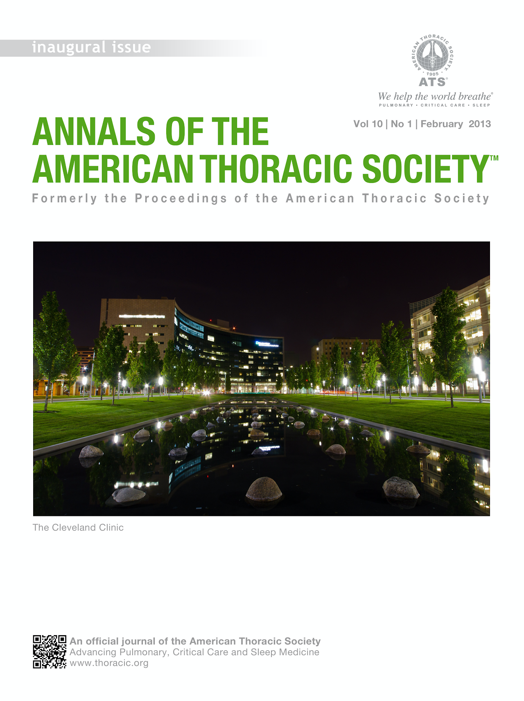

This is an incomplete sample of some of my papers. For a complete list, see my [CV](/cv/), or [Google Scholar page](https://scholar.google.com/citations?user=G-u6TvEAAAAJ). If you have difficulty locating a copy of any of these, please email me for a copy.

| <!-- -->    | + denotes mentored student   |
| :-: | :------------ |
|{: width="75px" align="left"} | 2020. **jimi adams**, Ryan Light, & Nicholas Theis (1st 2 authors contributed equally). “[Mobilizing COVID-19 Science](https://jimiadams.github.io/Contexts_PubMed/).” *Contexts* 19(4): 36-41.   [code](https://github.com/jimiadams/Contexts_PubMed){: .btn .btn--primary .btn--small} [doi](https://doi.org/10.1177/1536504220977933){: .btn .btn--inverse .btn--small}|
|{: width="75px" align="left"} | 2020. **jimi adams**, +Tatiane Santos, & +Venice Ng Williams. “[Strategies for Collecting Social Network Data:Overview, Assessment and Ethics](https://www.oxfordhandbooks.com/view/10.1093/oxfordhb/9780190251765.001.0001/oxfordhb-9780190251765-e-10).” Chapter 7 in Ryan Light & James Moody (eds.) *Oxford Handbook of Social Networks* Oxford University Press.   [preprint](https://osf.io/preprints/socarxiv/zgawf/){: .btn .btn--success .btn--small} [doi](https://doi.org/10.1093/oxfordhb/9780190251765.013.10){: .btn .btn--inverse .btn--small}|
|{: width="75px" align="left"} | 2020. Andrea G. Buchwald, **jimi adams**, David M Bortz, & Elizabeth J. Carlton. “[Infectious disease transmission models to predict, evaluate and improve understanding of SARS-COV-2 trajectory and interventions](https://www.atsjournals.org/doi/full/10.1513/AnnalsATS.202005-501PS).” *Annals of the American Thoracic Society* 17(10): 1204-1206.   [doi](https://doi.org/10.1513/AnnalsATS.202005-501PS){: .btn .btn--inverse .btn--small}|
