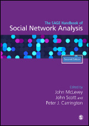

This is an incomplete sample of recent and/or key papers of mine. For a complete list, see my [CV](/cv/) or [Google Scholar page](https://scholar.google.com/citations?user=G-u6TvEAAAAJ). If you have difficulty locating a complete version of any of these, please email me for a copy. (+ notes mentored student)

| <!-- -->    | <!-- --> |
| :-: | :------------ |
|{: width="75px" align="left"} | 2023. **jimi adams** & Miranda J. Lubbers (authors contributed equally). “[Social Network Data Collection: Principles and Modalities]().” Chapter 40 in John McLevey, John Scott, & Peter J. Carrington (eds.) *Sage Handbook of Social Network Analysis*. SAGE.   [preprint](https://papers.ssrn.com/sol3/papers.cfm?abstract_id=4216936){: .btn .btn--success .btn--small} [book](https://us.sagepub.com/en-us/nam/the-sage-handbook-of-social-network-analysis/book277881){: .btn .btn--info .btn--small}|
|{: width="75px" align="left"} | 2023. +Nicholas W. Landry & **jimi adams**. “[On limitations of uniplex networks for modeling multiplex contagion.](https://journals.plos.org/plosone/article?id=10.1371/journal.pone.0279345)” *PLoS One* 18(1):e0279345.   [data](https://zenodo.org/record/7419544#.Y5-Is-zMKhZ){: .btn .btn--danger .btn--small} [code](https://github.com/nwlandry/multiplex-contagion/tree/v0.4){: .btn .btn--primary .btn--small}  [preprint](https://arxiv.org/abs/2204.12348){: .btn .btn--success .btn--small} [doi](https://doi.org/10.1371/journal.pone.0279345){: .btn .btn--inverse .btn--small}|
|{: width="75px" align="left"} | 2022. **jimi adams**, Elizabeth Lawrence, +Joshua Goode, David R. Schaefer, & Stefanie Mollborn. “[Peer Network Dynamics of Adolescents’ Health Lifestyles.](https://journals.sagepub.com/doi/suppl/10.1177/00221465211054394)” *Journal of Health & Social Behavior* 63(1): 125-141.   [data](https://www.icpsr.umich.edu/web/DSDR/studies/21600){: .btn .btn--danger .btn--small} [preprint](https://osf.io/preprints/socarxiv/xnd39/){: .btn .btn--success .btn--small} [doi](https://doi.org/10.1177/00221465211054394){: .btn .btn--inverse .btn--small}|
|{: width="75px" align="left"} | 2021. Andrea Buchwald, Jude Bayham, **jimi adams**, David Bortz, Katie Colborn, Olivia Zarella, Meghan Buran, Jonathan Samet, Debashis Ghosh, Rachel Herlihy, & Elizabeth J. Carlton. “[Estimating the Impact of State-Wide Policies to Reduce Spread of Severe Acute Respiratory Syndrome Coronavirus 2 in Real Time](https://wwwnc.cdc.gov/eid/article/27/9/20-4167_article).” *Emerging Infectious Diseases* 27(9): 2312-2322.   [data](https://github.com/agb85/CFpaper){: .btn .btn--danger .btn--small} [code](https://github.com/agb85/CFpaper){: .btn .btn--primary .btn--small}  [doi](https://doi.org/10.3201/eid2709.204167){: .btn .btn--inverse .btn--small}|
|{: width="75px" align="left"} | 2020. **jimi adams**, Ryan Light, & Nicholas Theis (1st 2 authors contributed equally). “[Mobilizing COVID-19 Science](https://doi.org/10.1177/1536504220977933).” *Contexts* 19(4): 36-41.   [code](https://github.com/jimiadams/Contexts_PubMed){: .btn .btn--primary .btn--small} [preprint](https://jimiadams.github.io/Contexts_PubMed/){: .btn .btn--success .btn--small} [doi](https://doi.org/10.1177/1536504220977933){: .btn .btn--inverse .btn--small}|
|{: width="75px" align="left"} | 2020. **jimi adams**, +Tatiane Santos, & +Venice Ng Williams. “[Strategies for Collecting Social Network Data:Overview, Assessment and Ethics](https://www.oxfordhandbooks.com/view/10.1093/oxfordhb/9780190251765.001.0001/oxfordhb-9780190251765-e-10).” Chapter 7 in Ryan Light & James Moody (eds.) *Oxford Handbook of Social Networks*. Oxford University Press.   [preprint](https://osf.io/preprints/socarxiv/zgawf/){: .btn .btn--success .btn--small} [book](https://global.oup.com/academic/product/the-oxford-handbook-of-social-networks-9780190251765){: .btn .btn--info .btn--small} [doi](https://doi.org/10.1093/oxfordhb/9780190251765.013.10){: .btn .btn--inverse .btn--small}|
|{: width="75px" align="left"} | 2020. **jimi adams**, David R. Schaefer, & Andrea Vest Ettekal. “[Crafting Mosaics: Person‐Centered Religious Influence and Selection in Adolescent Friendships](https://onlinelibrary.wiley.com/doi/abs/10.1111/jssr.12638).” *Journal for the Scientific Study of Religion* 59(1): 39-61.   [data](https://www.icpsr.umich.edu/web/DSDR/studies/21600){: .btn .btn--danger .btn--small} [preprint](https://osf.io/preprints/socarxiv/dc5gh/){: .btn .btn--success .btn--small} [doi](https://doi.org/10.1111/jssr.12638){: .btn .btn--inverse .btn--small}|
|{: width="75px" align="left"} | 2019. Stéphane Helleringer, **jimi adams**, Sara Yeatman & James Mkandawire. “[Evaluating sampling biases from third-party reporting as a method for improving survey measures of sensitive behaviors](../files/2019_SN.pdf).” *Social Networks* 59: 134-140.   [doi](https://doi.org/10.1016/j.socnet.2019.07.003){: .btn .btn--inverse .btn--small}|
|{: width="75px" align="left"} | 2017. James Moody, **jimi adams**, & Martina Morris. “[Epidemic potential by sexual activity distributions](../files/2017_NS.pdf).” *Network Science* 5(4): 461-475.   [doi](https://doi.org/10.1017/nws.2017.3){: .btn .btn--inverse .btn--small}|
|{: width="75px" align="left"} | 2016. Ryan Light & **jimi adams**. “[A Dynamic, Multidimensional Approach to Knowledge Production](https://muse.jhu.edu/chapter/1911891/pdf).” Chapter 6 in Scott Frickel, Mathieu Albert, & Barbara Prainsack (eds.) *Investigating Interdisciplinary Collaboration: Theory and Practice across Disciplines.* Rutgers University Press.   [preprint](https://osf.io/preprints/socarxiv/gek68/){: .btn .btn--success .btn--small} [book](https://www.rutgersuniversitypress.org/investigating-interdisciplinary-collaboration/9780813585888){: .btn .btn--info .btn--small} [doi](https://www.jstor.org/stable/j.ctt1j68m9r.11){: .btn .btn--inverse .btn--small}|
|{: width="75px" align="left"} | 2016. **jimi adams** & David R. Schaefer. “[How Initial Prevalence Moderates Network-Based Smoking Change: Estimating Contextual Effects with Stochastic Actor Based Models](../files/2016_JHSB.pdf).” *Journal of Health & Social Behavior* 57(1): 22-38.   [data](https://www.icpsr.umich.edu/web/DSDR/studies/21600){: .btn .btn--danger .btn--small} [doi](https://doi.org/10.1177%2F0022146515627848){: .btn .btn--inverse .btn--small}|
|{: width="75px" align="left"} | 2015. **jimi adams** & Ryan Light. “[Scientific Consensus, the Law, and Same Sex Parenting Outcomes](../files/2015_SSR.pdf).” *Social Science Research* 53: 300-310.   [doi](https://doi.org/10.1016/j.ssresearch.2015.06.008){: .btn .btn--inverse .btn--small} [DenPo](https://www.denverpost.com/2015/09/25/guest-commentary-the-consensus-is-that-children-from-gay-marriages-are-just-fine/){: .btn .btn--warning .btn--small}|
|{: width="75px" align="left"} | 2014. **jimi adams** & Ryan Light. “[Mapping Interdisciplinary Fields: Efficiencies, Gaps and Redundancies in HIV/AIDS Research](https://journals.plos.org/plosone/article?id=10.1371/journal.pone.0115092).” *PLoS One* 9(12): e115092.   [doi](https://doi.org/10.1371/journal.pone.0115092){: .btn .btn--inverse .btn--small}|
|{: width="75px" align="left"} | 2013. **jimi adams**, James Moody, & Martina Morris. “[Sex, Drugs, and Race: How Behaviors Differentially Contribute to Sexually Transmitted Infection Risk Network Structure](../files/2013_AJPH.pdf).” *American Journal of Public Health* 103: 322-329.   [data](https://www.icpsr.umich.edu/web/NAHDAP/studies/22140){: .btn .btn--danger .btn--small} [doi](https://doi.org/10.2105/AJPH.2012.300908){: .btn .btn--inverse .btn--small}|
|{: width="75px" align="left"} | 2012. **jimi adams**, James Moody, Stephen Q. Muth, & Martina Morris. “[Quantifying the Benefits of Link-Tracing Designs for Partnership Network Studies](../files/2012_FM.pdf).” *Field Methods* 24(2): 175-193.   [data](https://www.icpsr.umich.edu/web/NAHDAP/studies/22140){: .btn .btn--danger .btn--small} [doi](https://doi.org/10.1177/1525822X11433997){: .btn .btn--inverse .btn--small}|
|{: width="75px" align="left"} | 2012. Joshua Kjerulf Dubrow & **jimi adams**. “[Hoop inequalities: Race, class and family structure background and the odds of playing in the National Basketball Association](../files/2012_IRSS.pdf).” *International Review for the Sociology of Sport* 47(1): 43-59.   [doi](https://doi.org/10.1177/1012690210384660){: .btn .btn--inverse .btn--small} [NYT](https://www.nytimes.com/2013/11/08/opinion/youth-and-sports.html){: .btn .btn--warning .btn--small}|
|{: width="75px" align="left"} | 2009. **jimi adams** & Jenny Trinitapoli. “[The Malawi Religion Project: Data collection and selected analyses](https://www.demographic-research.org/volumes/vol21/10/21-10.pdf).” *Demographic Research* 21(10): 255-288.   [doi](https://doi.org/10.4054/DemRes.2009.21.10){: .btn .btn--inverse .btn--small}|
|{: width="75px" align="left"} | 2007. **jimi adams**. “[Stained Glass Makes the Ceiling Visible: Organizational Opposition to Women in Congregational Leadership](../files/2007_G&S.pdf).” *Gender & Society* 21(1): 80-105.   [data](https://www.thearda.com/Archive/Files/Descriptions/NCSIV.asp){: .btn .btn--danger .btn--small} [doi](https://doi.org/10.1177/0891243206293773){: .btn .btn--inverse .btn--small}|
|{: width="75px" align="left"} | 2007. **jimi adams** & James Moody. “[To tell the truth: Measuring concordance in multiply reported network data](../files/2007_SN.pdf).” *Social Networks* 29(1): 44-58.   [data](https://www.icpsr.umich.edu/web/NAHDAP/studies/22140){: .btn .btn--danger .btn--small} [doi](https://doi.org/10.1016/j.socnet.2005.11.009){: .btn .btn--inverse .btn--small}   And just for kicks - this first publication gave me an [Erdős number](http://en.wikipedia.org/wiki/Erd%C5%91s_number) of 4: [Erdős](http://en.wikipedia.org/wiki/Paul_Erd%C5%91s) [--](http://www.sciencedirect.com/science/article/pii/S0167506008706988) [Frank Harary](http://www.cs.nmsu.edu/fnh/) [--](https://escholarship.org/content/qt8585j6z4/qt8585j6z4.pdf) [Douglas R. White](https://en.wikipedia.org/wiki/Douglas_R._White) [--](https://www.jstor.org/stable/3088904?seq=1#metadata_info_tab_contents) [James Moody](https://scholars.duke.edu/person/james.moody) -- me. What's [yours](http://www.oakland.edu/enp/compute/)?|
